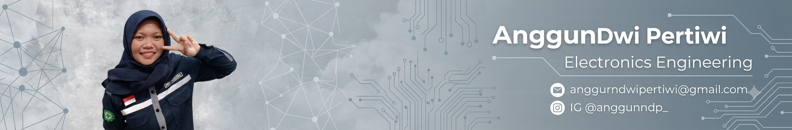

  

<b>Electronic Engineering Graduate | Automation, PLC & Embedded Systems Specialist</b>

  

  
  
  

---

### 🚀 Tentang Saya
Saya adalah lulusan **Teknik Elektronika** dari **Politeknik Negeri Semarang** dengan kompetensi kuat di bidang sistem kendali, otomatisasi industri, dan pemrograman mikrokontroler. Memiliki pengalaman praktis dalam menangani *preventive maintenance* mesin industri serta *troubleshooting* perangkat keras elektronik. Saya seorang profesional yang disiplin, analitis, jujur, dan siap berkontribusi secara optimal dalam tim maupun proyek mandiri.

---

### 🛠️ Keahlian Teknis (Technical Tech Stack)

<table>
  <tr>
    <td width="50%">
      <b>Software & Programming</b>  
      
    </td>
    <td width="50%">
      <b>Core Engineering Competencies</b> 
      <ul>
        <li>Pemrograman PLC & Sistem Otomatisasi</li>
        <li>Diagnosis & <i>Troubleshooting</i> Rangkaian</li>
        <li>Analisis Diagram Skematik Kompleks</li>
        <li>Instrumentasi & Kalibrasi Alat Ukur</li>
      </ul>
    </td>
  </tr>
</table>

---

### 💼 Pengalaman Magang Industri

<table>
  <tr>
    <th width="35%">Perusahaan & Posisi</th>
    <th width="65%">Kontribusi & Tanggung Jawab</th>
  </tr>
  <tr>
    <td>
      <b>PT. Phapros Tbk</b> 
      <i>Preventive Maintenance Dept.</i> 
      <small>Jan 2025 - Selesai</small>
    </td>
    <td>
      • Melakukan perawatan berkala (*preventive maintenance*) keandalan mesin produksi farmasi. 
      • Berkolaborasi aktif dalam menangani *troubleshooting* kerusakan teknis operasional mesin. 
      • Mengidentifikasi dan menganalisis komponen mesin untuk optimasi efisiensi kerja.
    </td>
  </tr>
  <tr>
    <td>
      <b>PT. Istana Argo Kencana (SANKEN)</b> 
      <i>Service Technician</i> 
      <small>Magang Industri - 2022</small>
    </td>
    <td>
      • Melakukan pemeriksaan awal (*incoming inspection*) komponen produk rumah tangga. 
      • Mendiagnosis kerusakan rangkaian elektro-mekanis dan melakukan perbaikan teknis. 
      • Memastikan hasil akhir perbaikan memenuhi standar kelayakan (*quality check*).
    </td>
  </tr>
  <tr>
    <td>
      <b>PT. LG Electronics Indonesia</b> 
      <i>Customer Service & Admin</i> 
      <small>Magang Industri - 2022</small>
    </td>
    <td>
      • Mengelola proses administrasi logistik dan pendataan unit masuk pusatservis. 
      • Melakukan inspeksi fisik serta pengecekan fungsional awal pada perangkat. 
      • Memanajemen basis data inventaris komponen (*spare parts stock control*).
    </td>
  </tr>
</table>

---

### 🎓 Pendidikan & Sertifikasi

* **Politeknik Negeri Semarang (POLINES)**  
  `Diploma 3 - Teknik Elektronika` | 2023 - 2026
* **SMK Negeri 3 Semarang**  
  `Teknik Audio Video` | 2020 - 2023
* **Sertifikasi Kompetensi BNSP (2025)**  
  `Sertifikasi Keahlian Bidang Elektronika` | Lembaga Sertifikasi Profesi resmi

---

### 🌟 Nilai Profesional (Soft Skills)

  
  
  
  

---

  <i>"Transforming complex schematic diagrams into functional, smart automation solutions."</i>

